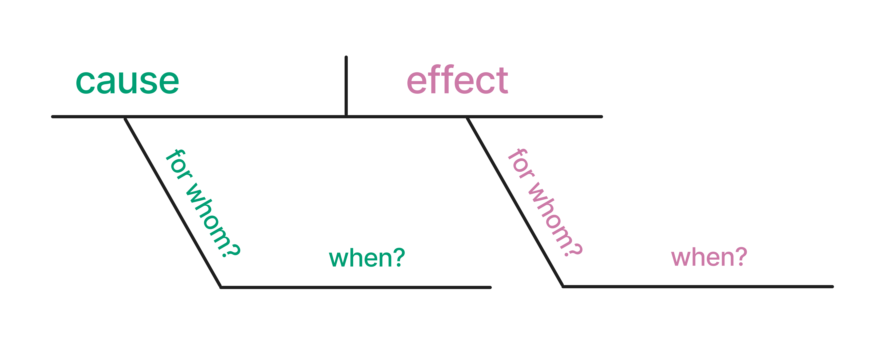
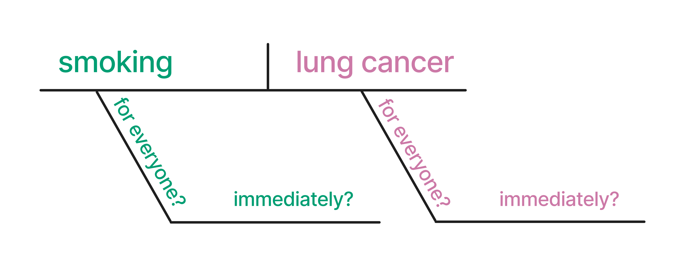
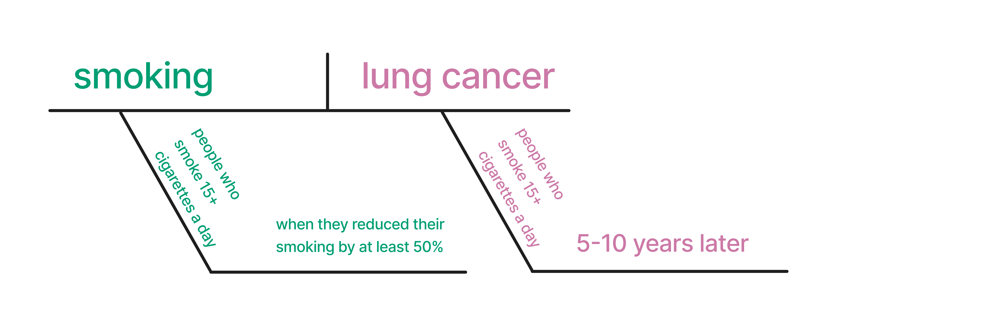
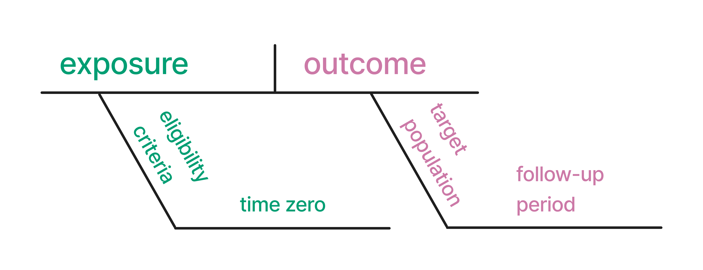

\mainmatter

# 从随意推断（casual inference）到因果推断（causal inference） {#sec-causal-question}



```{r}
#| echo: false

# TODO: remove when first edition complete
status("complete")
```

## 随意推断

因果分析的核心是因果问题；它决定我们分析什么数据、如何分析这些数据，以及我们的推断适用于哪些人群。本书具有应用性质，主要讨论因果推断中的分析阶段。与明确提出一个好的因果问题所涉及的复杂性相比，分析阶段要直截了当得多。在本书前六章中，我们将讨论什么是因果问题、如何改进我们的问题，并考察一些例子。

因果问题属于一类更广泛的问题；这些问题可以用统计技术来提出，并与数据科学的主要任务相关：描述、预测和因果推断
[@hernan2019]。不幸的是，这些任务常常被我们使用的技术（例如，回归对这三类任务都有帮助）以及我们谈论它们的方式混淆。当研究者有意从非随机化数据中进行因果推断时，我们经常使用"关联"（association）这样的委婉说法，而不是直接声明我们想要估计因果效应
[@Hernan2018]。

例如，近期一项关于流行病学研究中分析语言的研究发现，用来描述估计效应的最常见词根是"associate"，但许多研究者也认为"associate"至少暗示了*某种*因果效应
(@fig-word-ranking) [@haber_causal_language]。在被分析的研究中，只有约 1%
使用过"cause"这个词根。然而，三分之一的研究提出了行动建议，研究者认为其中 80%
的建议至少含有某种因果含义。这些研究的行动建议（暗指因果效应）往往比其对效应的描述（例如"associate"和"compare"等词根）所暗示的因果含义更强。尽管许多研究暗示其目标是因果推断，但只有约
4%
使用了本书所讨论的那类正式因果模型。不过，多数研究会讨论如何通过既有研究或理论来支持这种因果关系。

```{r}
#| label: "fig-word-ranking"
#| fig-cap: >-
#|   研究者所用词根的因果强度排序。Strong 排名更多的词根，比 None 或 Weak 排名较多的词根具有更强的因果含义。数据来自
#|   @haber_causal_language。
#| fig-height: 9
#| echo: false

rankings <- read_csv(
  here::here("data/word_rankings.csv"),
  show_col_types = FALSE
) |>
  janitor::clean_names()

lvls <- rankings |>
  count(rating, root_word) |>
  filter(rating == "Strong") |>
  arrange(desc(n)) |>
  mutate(root_word = fct_inorder(root_word)) |>
  pull(root_word) |>
  levels()

rankings |>
  count(rating, root_word) |>
  mutate(root_word = factor(root_word, levels = lvls)) |>
  filter(!is.na(root_word)) |>
  group_by(rating) |>
  mutate(rank = n / sum(n)) |>
  ungroup() |>
  drop_na(rating) |>
  mutate(
    rating = factor(rating, levels = c("None", "Weak", "Moderate", "Strong"))
  ) |>
  ggplot(aes(x = rank, y = root_word, fill = rating)) +
  geom_col(position = position_fill(reverse = TRUE)) +
  scale_fill_viridis_d(direction = -1) +
  labs(
    title = "Causal strength of root words",
    subtitle = glue::glue(
      "Root words were ranked as: ",
      '<span style="color:#FDE725FF">**None**</span>, ',
      '<span style="color:#35B779FF">**Weak**</span>, ',
      '<span style="color:#31688EFF">**Moderate**</span>, ',
      'or <span style="color:#440154FF">**Strong**</span>'
    ),
    x = NULL,
    y = NULL
  ) +
  scale_x_continuous(labels = scales::percent) +
  theme(
    axis.ticks = element_blank(),
    panel.grid.major = element_blank(),
    plot.title.position = "plot",
    plot.subtitle = ggtext::element_markdown(),
    legend.position = "none"
  )
```

由于没有提出假设和目标都清楚明白的问题，我们最终得到的是"薛定谔的因果推断"：

> 我们的结果表明，"薛定谔的因果推断"很常见：研究一方面避免声明（甚至明确否认）自己有兴趣估计因果效应，另一方面却充满了因果意图、推断、含义和建议。
>
> --- @haber_causal_language

这种做法是*随意*推断的一个例子：在没有完成必要工作来理解因果问题、也没有处理回答这些问题所需假设的情况下作出推断。

## 描述、预测和解释

解决这一问题的一个很好的第一步，是认识到关于描述、预测和解释的问题在根本上是不同的。与学术科学相比，工业界数据科学受"薛定谔的因果推断"的负担没有那么重，但*随意*推断还会以许多其他方式出现。例如，当利益相关者询问某个事件的"驱动因素"时，他们到底在问什么？是在要求一个预测该事件的模型吗？还是想更深入地理解是什么导致了该事件？这是一个含糊的请求，但在我们看来它明显带有因果兴趣；然而，许多数据科学家会倾向于用预测模型来回答这个问题。当我们明确自己的目标时，就能更有效地使用这三种方法（而且正如我们将看到的，当目标是进行因果推断时，描述性分析和预测模型仍然有用）。此外，这三种方法都是有用的决策工具。

### 描述

描述性分析旨在描述变量的分布，通常会按关键感兴趣变量进行分层。一个密切相关的概念是探索性数据分析（EDA），不过描述性研究通常比
EDA 有更明确的目标。

描述性分析通常基于统计摘要，例如集中趋势（均值、中位数）和离散程度（最小值、最大值、四分位数）的度量，但有时也会使用回归建模等技术。在描述性分析中，使用回归这类更高级技术的目标不同于预测研究或因果研究。在描述性分析中对某个变量进行"调整"，意味着我们移除了它的关联效应（因此改变了我们的问题），*并不*意味着我们控制了混杂。

在流行病学中，一个对描述性分析很有价值的概念是"人、地点和时间"------谁在何处、何时患有什么疾病。这个概念也是其他领域进行描述性分析的一个良好模板。通常，我们希望清楚说明自己试图描述的是什么人群，因此需要尽可能具体。对人类健康而言，描述涉及的人、地点和时期都至关重要。换句话说，要关注形成对数据理解的第一性原则，并据此描述你的数据。

#### 例子

计数是我们能用数据做的最好的事情之一。EDA
对预测分析和因果分析都有益，但描述性分析本身也独立于其他分析任务而具有价值。你可以问问任何一位原以为自己会开发复杂机器学习模型、结果发现大部分时间都花在仪表盘上的数据科学家。理解数据的分布，尤其是围绕关键分析目标（例如工业界的
KPI 或流行病学中的疾病发生率）的分布，对于许多类型的决策都至关重要。

近期描述性分析的最佳例子之一来自 COVID-19 大流行 [@Fox2022]。2020
年，尤其是在大流行早期，描述性分析对于理解风险和分配资源至关重要。由于冠状病毒与其他呼吸道疾病相似，我们已有许多可降低风险的公共卫生工具（例如保持距离，以及后来使用口罩）。按地区统计的病例描述性统计，对于决定地方政策及其力度至关重要。

大流行期间一个更复杂的描述性分析优秀例子，是《金融时报》持续发布的关于各个国家和地区[预期死亡人数与观察死亡人数](https://www.ft.com/content/a2901ce8-5eb7-4633-b89c-cbdf5b386938)的报告[^01-casual-to-causal-1]。虽然预期死亡人数的计算比多数描述性统计稍微复杂一些，但它在无需理清因果效应的情况下（例如，这些死亡是否直接由
COVID-19 导致？是否由于医疗服务不可及？是否为 COVID
后心血管事件？）提供了大量关于当前死亡情况的信息。在这里对其 2020 年 7
月图形的（简化）复现中，你可以看到大流行早期数月所造成的惊人影响。

[^01-casual-to-causal-1]: John Burn-Murdoch
    负责了其中许多展示，并就该主题做过一次[精彩演讲](https://cloud.rstudio.com/resources/rstudioglobal-2021/reporting-on-and-visualising-the-pandemic/)。

```{r}
#| label: fig-ft-chart
#| fig-width: 10
#| fig-height: 7.5
#| fig-cap: "2020 年超额死亡人数与历史上所有原因预期死亡人数的比较。数据来自《金融时报》。"
#| echo: false
#| message: false

ft_excess_deaths <- read_csv(here::here("data/ft_excess_deaths.csv")) |>
  mutate(year = factor(year))

excess_deaths_prior_wk <- ft_excess_deaths |>
  filter(year != 2020)

excess_deaths2020_wk <- ft_excess_deaths |>
  filter(year == 2020)

excess_deaths_wk <- ft_excess_deaths |>
  filter(year == 2020)

ggplot(
  data = excess_deaths_prior_wk,
  aes(x = week, y = deaths, group = year)
) +
  geom_line(color = "grey75", alpha = 0.6) +
  geom_line(
    data = excess_deaths2020_wk,
    color = "#D55E00"
  ) +
  geom_ribbon(
    data = excess_deaths2020_wk,
    aes(ymin = pmin(deaths, expected_deaths), ymax = deaths),
    fill = "#D55E00",
    alpha = 0.7
  ) +
  geom_line(
    data = excess_deaths_wk,
    aes(x = week, y = expected_deaths),
    color = "steelblue",
    linewidth = 0.9,
    inherit.aes = FALSE
  ) +
  facet_wrap(vars(country), scales = "free_y") +
  scale_y_continuous(labels = scales::label_comma(), n.breaks = 4) +
  labs(
    x = NULL,
    y = NULL,
    title = "<span style = 'color:#D55E00;'>**2020 deaths**</span> compared to <span style = 'color:#4682b4;'>**expected deaths**</span>",
    subtitle = "Number of deaths per week from all causes vs. recent years"
  ) +
  theme(
    text = element_text(size = 18),
    axis.text.x = element_blank(),
    plot.title = ggtext::element_markdown(),
    plot.title.position = "plot"
  )
```

下面还有一些优秀的描述性分析例子。

- **全球森林砍伐**。 Our World in Data [@owidforestsanddeforestation]
  是一个数据新闻组织，会针对各种主题制作有思考深度、通常属于描述性的报告。在这份报告中，他们展示了森林覆盖的绝对变化（森林转变）和相对变化（砍伐或再造林）的数据可视化，并结合基础统计和林业理论，呈现了关于森林随时间变化状况的有用信息。
- **衣原体和淋球菌感染的患病率** [@Miller2004]。
  测量疾病患病率（当前有多少人患有某种疾病，通常以每多少人的比例表示）有助于基础公共卫生工作（资源、预防、教育）和科学理解。在这项研究中，作者开展了一项复杂调查，旨在代表美国所有高中（目标人群）；他们使用调查权重来处理与其问题相关的多种因素，然后计算患病率比和其他统计量。正如我们将看到的，权重在因果推断中也因为同样的原因而有用：瞄准特定人群。尽管如此，并非所有加权技术本质上都是因果性的，这里也不是。
- **估计特定种族和族裔的子宫切除术不平等** [@Gartner2020]。
  描述性技术也帮助我们理解经济学和流行病学等领域中的不平等。在这项研究中，作者问道：子宫切除术的风险是否因种族或族裔背景而异？尽管该分析按关键变量进行了分层，但它仍然是描述性的。这篇论文另一个有意思的方面，是作者努力确保研究回答的是关于正确目标人群的问题。他们的分析结合了多个数据来源，以便更好地估计真实人群患病率（而不是像常见做法那样只估计医院人群中的患病率）。他们还对既往子宫切除术的患病情况进行了调整；例如，他们只在实际可能接受子宫切除术的人群中计算发生率（新发病例率）（例如，这些人尚未做过子宫切除术）。

#### 有效性

描述性分析中有两个关键的有效性问题：测量误差和抽样误差。

测量误差指的是我们在某种程度上错误测量了一个或多个变量。对描述性分析而言，测量错误意味着我们可能无法得到问题的答案。然而，这种情况的严重程度取决于测量误差本身的严重性和所提问题。

抽样误差在描述性分析中是一个更细致的问题。它与我们正在分析的人群（分析应当描述谁）以及不确定性（我们有多确定有数据者的描述能够代表我们试图描述的人群）有关。

我们的数据来源人群和我们试图描述的人群必须相同，我们才能给出有效的描述。设想一个由在线调查生成的数据集。回答这些问题的人是谁？他们与我们想要描述的人有什么关系？在许多分析中，愿意花时间回答调查的人不同于我们想要描述的人；例如，填写调查的一组人，其变量分布可能不同于不填写调查的人。这类数据得到的结果在技术上并不是有偏的，因为除了与样本量相关的不确定性和测量误差之外，这些描述是准确的------它们只是并不针对正确的人群！换句话说，*我们得到了错误问题的答案*。

值得注意的是，有时我们的数据代表了整个总体（或足够接近整个总体），因此抽样误差无关紧要。设想一家公司拥有所有使用其服务的客户的某些数据。对许多分析而言，这代表了我们希望获得信息的整个总体（当前客户）。类似地，在拥有覆盖全人口健康登记系统的国家，为特定实践目的可获得的数据已经足够接近整个总体，因此不需要抽样（尽管研究者可能会为了简化计算而使用抽样）。在这些情况下，实际上并不存在通常意义上的不确定性。假设所有内容都被良好测量，我们生成的摘要统计量*本质上是无偏且精确的*，因为我们拥有总体中每个人的信息。当然，在实践中，即使在最理想的情况下，我们通常也会遇到某种混合的测量误差、缺失数据等问题。

描述性分析的一个关键细节是，混杂偏倚这个本书的主要关注点之一，在这里并没有定义。这是因为混杂是一个因果问题。描述性分析不可能被混杂，因为它们只是对关系*现状*的统计描述，而不是对这些关系背后机制的说明。

#### 与因果推断的关系

人类非常擅长发现模式。寻找模式是我们大脑的有用特征，但当我们使用的数据或方法并不能使这类推断有效时，它也可能让我们滑向不当推断。当你的目标是描述时，最需要警惕的是从描述跳到因果（无论是隐含地还是明确地）。

当然，当我们*确实*在估计因果效应时，描述性分析也很有帮助。它帮助我们理解正在处理的人群、结局的分布、暴露（我们认为可能具有因果作用的变量）以及混杂因素（为了获得暴露的无偏因果效应而需要考虑的变量）。它还帮助我们确认正在使用的数据结构与我们试图回答的问题相匹配，正如我们将在
[Chapter -@sec-data-causal]
中看到的。在开展因果研究时，你应当始终对数据进行描述性分析。

最后，正如我们将在 [Chapter -@sec-strat-outcome]
中看到的，在某些情形下，我们可以用基础统计量进行因果推断。这里同样要谨慎区分因果问题和描述性成分：仅仅因为我们使用了相同的计算（例如均值差），并不意味着你能生成的所有描述都是因果性的。描述性分析是否与因果分析重叠，取决于数据和问题。

### 预测

预测的目标是使用数据对变量作出准确预测，通常是在新数据上进行预测。这具体意味着什么，取决于问题、领域等。预测模型被用于几乎所有可以想象的场景，从经同行评议的临床模型，到嵌入消费设备的定制机器学习模型。甚至像
ChatGPT 所基于的大语言模型也是预测模型：它们预测对某个提示的回应会是什么样。

预测建模通常使用与本书将介绍的因果建模工作流不同的工作流。由于预测的目标通常与在新数据上进行预测有关，这类建模的工作流侧重于在保持对新数据泛化能力的同时最大化预测准确性，有时称为偏差-方差权衡。在实践中，这意味着将数据分为训练集（用于建立模型的数据部分）和测试集（用于评估模型的数据部分，它是模型在新数据上表现的代理）。通常，数据科学家会使用交叉验证或其他抽样技术，进一步降低模型对训练集过拟合的风险。

关于预测建模已有许多优秀文本，因此我们建议你参考这些资料，以更深入地了解这些技术的目标和方法
[@kuhn2013a; @harrell2001; @Kuhn_Silge_2022; @James_Witten_Hastie_Tibshirani_2022]。

#### 例子

预测是数据科学中最受欢迎的话题，这在很大程度上得益于工业界的机器学习应用。当然，预测在统计学中有悠久历史，许多今天流行的模型已经在学术界内外使用了几十年。

让我们看一个关于 COVID-19 的预测例子 [^01-casual-to-causal-2]。2021
年，研究者发表了 ISARIC 4C Deterioration model，这是一个用于预测急性 COVID-19
严重不良结局的临床预后模型
[@Gupta2021]。作者纳入了一项描述性分析，以理解该模型开发所依托的人群，尤其是结局和候选预测因子的分布。这个模型的一个有用之处在于，它使用的是
COVID
相关住院第一天通常会测量的项目。作者通过按英国地区进行交叉验证来建立该模型，然后在一个留出地区的数据上测试该模型。最终模型包含
11
个项目，并描述了这些项目的模型属性、与结局的关系等。值得注意的是，作者使用临床领域知识来选择候选变量，但并没有落入把模型系数解释为因果效应的诱惑。毫无疑问，其中一些预测变量与结局存在因果关系，但并非全部如此，模型也没有试图估计这些因果关系。

[^01-casual-to-causal-2]: 另见
    [Chapter -@sec-dags]，其中还会讨论同一主题的一个因果研究例子。

- Netflix
  定期在其[研究博客](https://research.netflix.com/)中分享建模成功经验和新策略。他们最近还发表了一篇论文，回顾了深度学习模型在推荐系统中的应用（在这个例子中，是向用户推荐节目和电影）[@steck2021]。这篇论文阐述了他们目标的细节、所用模型的细节，以及他们遇到的许多挑战，从而形成了一份关于使用这类模型的实践指南。

- 2020 年初，具有健康研究中预测和预后建模经验的研究者发表了一篇关于 COVID-19
  诊断和预后模型的综述
  [@Wynants2020]。这篇综述不仅因其覆盖范围广而有意思，也因为被评为质量较差的模型数量惊人："\[232\]
  个模型被评为偏倚风险高或不明确，主要原因包括对照患者选择不具代表性、排除了在研究结束时尚未经历感兴趣事件的患者、模型过拟合风险高以及报告不清楚。"这项研究也是一项[动态综述](https://www.covprecise.org/)。

#### 有效性

预测建模中有效性的关键衡量指标是预测准确性，可以通过多种方式测量，例如均方根误差（RMSE）、平均绝对误差（MAE）、曲线下面积（AUC）等。预测建模的一个方便之处在于，我们通常可以评估自己是否正确；而对于只有部分数据的描述性统计，或真实因果结构未知的因果推断，这一点并不成立。我们并不总是能够与真值比较，但在拟合初始预测模型时，这几乎总是必需的
[^01-casual-to-causal-3]。

[^01-casual-to-causal-3]: 我们这里说的是单数"模型"，但数据科学家通常会为了实验拟合许多模型，而且最好的预测模型往往是多个模型预测的某种组合，称为堆叠模型。

测量误差也是预测建模中的一个问题，因为我们通常需要准确的数据才能进行准确预测。有趣的是，在预测场景中，测量误差和缺失本身可能包含信息。在因果场景中，这可能会引入偏倚，但预测模型可以毫无问题地利用这些信息。例如，在著名的
Netflix Prize
中，获胜模型利用了客户是否曾经为某部电影评分这一信息来改进推荐系统。

与描述性分析类似，混杂在预测建模中没有定义。预测模型中的系数不可能被混杂；我们关心的只是该变量是否提供预测信息，而不是这些信息是否来自因果关系或其他原因。

#### 与因果推断的关系

预测中最大的单一风险，是假定模型中的某个系数具有因果解释。这种假定很可能不成立。一个模型可能预测得很好，但从因果角度看，它的系数也可能完全有偏。我们将在
@sec-pred-or-explain 和本书其余部分进一步讨论这一点。

人们常常错误地把用于预测模型的特征（变量）选择方法，用来选择因果模型中的混杂因素。除了这些方法存在过拟合风险之外，它们适用于预测模型，却不适用于因果模型。预测指标无法确定你的问题的因果结构，而某个变量对结局具有预测价值，也并不使它成为混杂因素。一般来说，应当由背景知识（而不是预测或关联统计）来帮助你为因果模型选择变量
@robinsImpossible；我们将在 [Chapter -@sec-dags] 和
[Chapter -@sec-building-models] 中详细讨论这一过程。

尽管如此，预测对因果推断依然至关重要。从哲学角度看，我们是在比较不同*如果......会怎样*情景下的预测：如果一件事发生，结局会是什么；如果另一件事发生，结局又会是什么？我们会花大量时间讨论这个主题，尤其是在
[Chapter -@sec-counterfactuals]
中。我们还会从实践角度大量讨论预测：就像在预测以及某些描述任务中一样，我们会使用建模技术来回答因果问题。倾向评分方法和
g-计算等技术使用模型预测来回答因果问题，但建立和解释这些模型本身的工作流非常不同。

### 因果推断

因果推断的目标，是理解某个变量（有时称为暴露）对另一个变量（有时称为结局）的影响。"暴露"和"结局"是本书用来描述我们感兴趣的因果关系的术语。重要的是，我们的目标是清楚而精确地回答这个问题。在实践中，这意味着使用研究设计（例如随机试验）或统计方法（例如倾向评分）来计算暴露对结局的无偏效应。

与预测和描述一样，最好从一个清楚、精确的问题开始，这样才能得到清楚、精确的答案。在统计学和数据科学中，尤其是当我们在现代世界的数据海洋中穿行时，我们常常最终得到一个没有问题的答案（例如
[`42`](https://en.wikipedia.org/wiki/42_(number)#The_Hitchhiker's_Guide_to_the_Galaxy)）。当然，这会使答案的解释变得困难。在
@sec-diag 中，我们将讨论因果问题的结构。我们将在 [Chapter -@sec-counterfactuals]
中讨论从哲学和实践层面锤炼问题的方法。

::: callout-note
## 因果推断与解释

有些作者把"因果推断"和"解释"这两个短语互换使用。我们对此稍微谨慎一些。因果推断总是与解释有关，但我们可以在并不了解其发生机制的情况下，准确估计一件事对另一件事的效应。

以 John Snow 为例，他被称为流行病学之父。1854 年，Snow
对伦敦一次霍乱暴发进行了著名调查，并确认特定水源是导致该病的原因。他是对的：受污染的水是霍乱传播的机制。然而，他并没有足够信息来解释具体机制：导致霍乱的细菌
*Vibrio cholerae* 直到近 30 年后才被确认。
:::

### 例子

本书会看到许多因果推断的例子，但我们先继续看一个与 COVID-19
相关的例子。随着大流行持续，疫苗和抗病毒治疗等工具陆续可用，普遍佩戴口罩等政策也开始变化。2022
年 2 月，美国马萨诸塞州撤销了一项要求公立学校普遍佩戴口罩的全州政策
[@Cowger2022]。在大波士顿地区，一些学区继续执行该政策，而另一些学区停止执行；停止执行的学区也在政策变化后的数周内于不同时间停止。这种政策差异使研究者能够利用这一时期学区政策之间的差异，研究普遍佩戴口罩对
COVID-19 病例的影响。研究者纳入了对学区的描述性分析，以理解与 COVID-19
及其他健康决定因素相关因素的分布。为估计普遍佩戴口罩对病例的影响，作者使用了一种在政策相关因果推断中常见的技术，称为双重差分，来估计这一效应（我们将在
@sec-did
中讨论）。作者发现，继续要求佩戴口罩的学区，其病例数远低于未继续要求的学区；他们的分析得出结论，政策变化导致了近
12,000 例额外病例，约占研究 15 周期间这些学区病例的近 30%。

<!-- TODO: add example when code and data are available -->

下面还有几个有意思的例子：

- Netflix 经常在工作中使用因果推断。2022
  年，他们发表了一篇[博客文章，总结了他们参与的一些因果任务](https://netflixtechblog.com/a-survey-of-causal-inference-applications-at-netflix-b62d25175e6f)。一个有意思的例子是本地化。Netflix
  面向全球用户，通过字幕和配音来本地化内容。随机实验并不是一个好主意，因为这意味着要向用户暂不提供内容，因此
  Netflix
  的研究者使用了几种方法来理解本地化的价值，同时处理潜在混杂。一个例子是研究疫情相关配音延迟的影响。研究者使用合成控制 (@sec-did)
  来模拟存在和不存在这些延迟时对观看量的影响。可以推测，疫情相关延迟发生的时间与通常会影响配音流程的许多因素无关，因此减少了一部分潜在混杂。

- Tuskegee Study
  是现代史上最臭名昭著的医疗滥用例子之一。人们通常把它视为美国黑人对医疗界不信任的来源之一。健康经济学研究者使用双重差分技术的一个变体，评估
  Tuskegee Study 对老年黑人男性的不信任和预期寿命的影响
  [@Alsan2018]。结果重要而令人不安："我们发现，1972
  年该研究被披露与老年黑人男性医疗不信任和死亡率上升、门诊和住院医师互动减少相关。我们的估计表明，在披露事件影响下，45
  岁黑人男性的预期寿命最多下降 1.5 年，这约占 1980
  年黑人男性与白人男性预期寿命差距的 35%，以及黑人男性与女性差距的 25%。"

#### 有效性

作出有效的因果推断需要若干假设，我们将在 @sec-assump
中讨论。不同于预测，我们通常无法确认自己的因果模型是否正确。换句话说，我们需要作出的大多数假设都是不可验证的。我们将在本书中反复回到这一主题------从这些假设的基础，到实践决策，再到检查模型中的问题。

### 为什么正确的因果模型不就是最好的预测模型？ {#sec-pred-or-explain}

到这里，你可能会想，为什么正确的因果模型不就是最好的预测模型。两者相关是有道理的：自然地，会导致其他事物的因素也会是预测因子。因果关系层层相连，因此任何预测信息在某种程度上都与我们所预测事物的因果结构有关。难道不应该认为，一个预测得好的模型也具有因果性吗？确实，*有些*预测模型可以是很好的因果模型，反之亦然。不幸的是，情况并不总是如此；因果效应不一定有很好的预测能力，而好的预测因子也不一定在因果上无偏
[@shmueli2010a]。仅凭数据无法知道这一点，这正是 @sec-quartets 的主题。

我们先从因果视角看，因为它稍微简单一些。设想一个针对某个暴露的因果无偏模型，它只包含同时与结局*和*暴露相关的变量。换句话说，这个模型为我们感兴趣的暴露提供了正确答案，但并不包含结局的其他预测因子（有时这可能是个好主意，正如
@sec-strat-outcome
中所讨论的）。如果一个结局有许多原因，那么一个准确描述其与单一暴露关系的模型，很可能无法很好地预测该结局。同样，如果暴露对结局的真实因果效应很小，它带来的预测价值也很有限。换句话说，一个模型的预测能力无论高低，都无法帮助我们区分该模型是否给出了正确答案。当然，低预测能力也可能表明某个因果效应从应用角度看并没有太大用处，尽管这还取决于若干统计因素。

预测模型并不总是无偏因果模型，还有两个更复杂的原因。第一个原因，我们考虑一个从因果角度看准确的模型：它估计对某个结局的效应，而且所有这些效应都是无偏的。即使在这种理想情形下，你也可能用另一个模型得到更好的预测。原因与预测建模中的偏差-方差权衡有关。当效应很小、数据噪声很大、预测因子高度相关，或数据量不多时，使用带有偏倚的模型（如惩罚回归）可能是有道理的。这些模型有意引入偏倚，以换取样本外预测中方差的改善。由于预测和因果推断的目标不同（通常是对样本外观察进行准确预测，而不是估计无偏效应），最适合推断的模型不一定是最好的预测模型。

<!-- TODO: maybe include a simulation to prove it? -->

第二，从因果角度看有偏的变量，往往也会带来预测能力。我们将在 @sec-dags
中讨论哪些变量应当纳入模型、哪些变量*不应*纳入模型，但先看一个简单例子。一个著名的混杂关系例子，是夏季冰淇淋销量与犯罪之间的关系。[从描述上看，冰淇淋销量与犯罪有关](https://slate.com/news-and-politics/2013/07/warm-weather-homicide-rates-when-ice-cream-sales-rise-homicides-rise-coincidence.html)，但这种关系受到天气混杂；例如，天气较暖时，冰淇淋销量和犯罪都会增加。（当然，这是简化说法，因为天气本身并不导致犯罪，但它位于因果路径上。）

考虑一个思想实验：你身处一个黑暗房间。你的目标是预测犯罪，但你不知道天气或一年中的时间。不过，你有冰淇淋销量的信息。一个用冰淇淋销量预测犯罪的模型，从因果角度看会是有偏的------冰淇淋销量并不导致犯罪，即使模型会显示出一个效应------但它会为你的犯罪模型提供一些预测价值。这两个条件背后的原因相同：天气和冰淇淋销量相关，天气和犯罪也相关。冰淇淋销量可以成功地（尽管并不完美地）作为天气的代理。这会导致对冰淇淋销量对犯罪的因果影响的效应估计有偏，但也会部分有效地预测犯罪。其他从因果角度看无效的变量，无论是自身有偏，还是会把偏倚引入因果效应估计，也常常带来良好的预测价值。因此，预测准确性并不是衡量因果性的好指标。

一个密切相关的概念是 *Table Two
Fallacy*，之所以这样命名，是因为在健康研究论文中，描述性分析通常呈现在表
1，而回归模型通常呈现在表 2 [@Westreich2013]。Table Two Fallacy
指的是研究者呈现混杂因素和其他非暴露变量，尤其是当他们把这些系数也解释为因果效应时。问题在于，在某些情况下，用于估计某个变量无偏效应的模型，可能并不是用于估计另一个变量无偏效应的同一个模型。换句话说，我们不能把混杂因素的效应解释为因果效应，因为它们*自身*也可能被另一个与原始暴露无关的变量所混杂。

描述性、预测性和因果性分析总会相互包含一些成分。预测模型的一部分预测能力来自结局的因果结构，而因果模型也因为包含关于结局的信息而具有一定预测能力。然而，同一个模型在同一份数据中，如果目标不同，其有用性也会随着目标而不同。
<!-- TODO: uncomment this when section is written -- We'll dive more deeply into this topic in @sec-causal-pred-revisit. -->

## 图解一个因果主张 {#sec-diag}

每项分析任务，无论是描述性、预测性还是推断性，都应当从一个清楚、精确的问题开始。让我们把它们图解出来，以便更好地理解因果问题的结构（我们会把注意力重新转回因果问题）。句子图解是一种语法方法，用来以视觉方式表示句子的结构，有时会在语法课中教授。在这种技术中，句子被拆解为其组成部分，例如主语、动词、宾语和修饰语，然后用一系列线条和符号显示出来。这些元素在图中的排列反映了它们的句法角色，以及它们如何在句子的整体结构中相互作用。通过把句子拆解成这些视觉表示，图解可以帮助学习者把握句子构造的细微差别，识别语法错误，并理解词语之间复杂的联系。我们可以把类似想法应用到因果主张上。下面是一个可能如何图解因果主张的例子。我们提取出了*原因*、*结果*、*主体*（对谁？）和*时间*（何时？）。

```{r}
#| echo: false
#| fig-cap: "图解因果主张的示例。"
#| fig-height: 2
#| label: fig-diagram-1


```

让我们从一个基本因果问题开始：吸烟会导致肺癌吗？

这里的因果主张可以是：吸烟导致肺癌。@fig-diagram-2
展示了这一因果主张的一种可能图解。

```{r}
#| echo: false
#| label: fig-diagram-2
#| fig-height: 2
#| fig-cap: "“吸烟导致肺癌”这一因果主张的图解。"


```

让我们更具体一些。2005
年，*JAMA*（《美国医学会杂志》）发表了一项研究，题为"Effect of Smoking Reduction
on Lung Cancer Risk"。该研究得出结论："在每天吸 15
支或更多香烟的人群中，将吸烟量减少 50%
会显著降低肺癌风险"。[@godtfredsen2005effect] 该研究将所研究的时间范围描述为
5-10
年。让我们图解这个因果主张。这里，我们假设估计因果效应的入选标准和目标人群相同（每天吸
15 支或更多香烟的人）；但情况并不总是如此。在 @sec-estimands
中，我们将讨论其他可能的目标人群。

```{r}
#| echo: false
#| fig-cap: "基于 @godtfredsen2005effect 结果的更具体因果主张图解示例。"
#| label: fig-diagram-3


```

把这一想法转化为提出好的因果问题，我们可以把贯穿本书会看到的以下术语映射到这些图解中：*暴露*（原因）、*结局*（结果）、*入选标准*（对谁？）、*时间零点*（参与者何时开始随访？）、*目标人群*（我们能为谁估计结局效应？）以及*随访期*（何时？）。

```{r}
#| echo: false
#| label: fig-diagram-4
#| fig-height: 2
#| fig-cap: "映射到因果分析术语的图解示例"


```

提出好的因果问题，意味着我们要把问题映射到可观察证据上。让我们回到吸烟的例子。我们最初的问题是：*吸烟会导致肺癌吗？*；研究中的证据表明，对于每天吸
15 支以上香烟的人，在 5-10 年内将吸烟量减少 50%
会降低肺癌风险。答案与问题匹配吗？并不完全匹配。让我们更新问题，使其与研究实际显示的内容一致：*对于每天吸
15 支以上香烟的人，在 5-10 年内将吸烟量减少 50% 是否会降低肺癌风险？*
打磨这种技能------提出可回答的因果问题------至关重要，我们将在本书中持续讨论。
